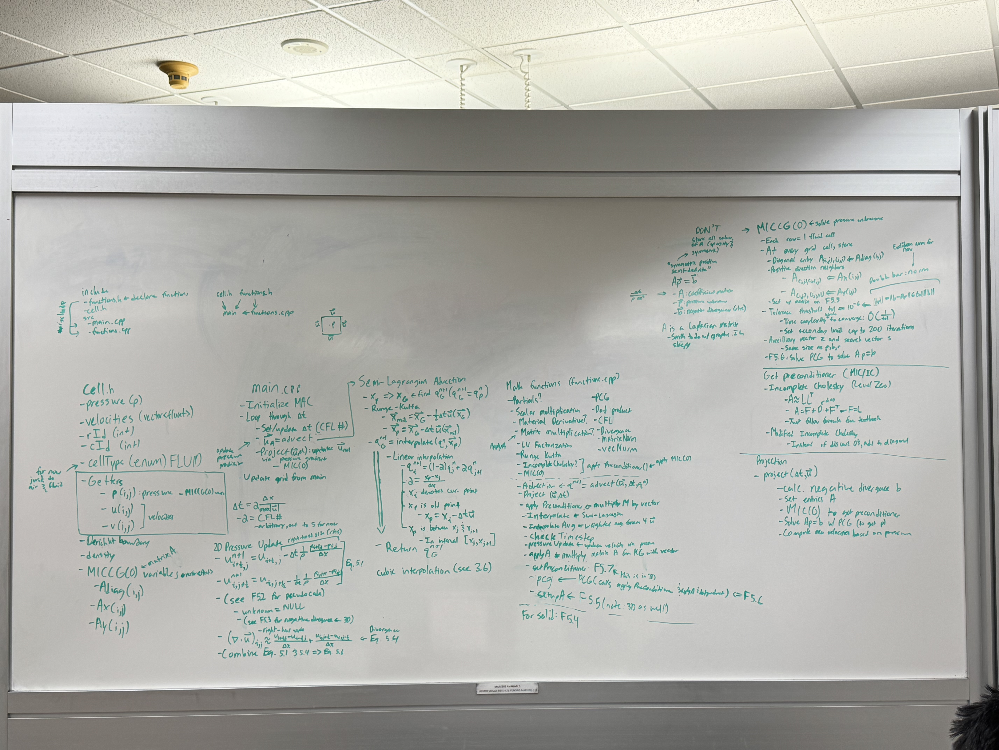

# Eulerian Fluid Simulation

Currently rewriting from scratch.

## Basics/Motivation

We are motivated by two equations (Navier-Stokes)

- $\nabla \bullet \vec{u}=0$ (incompressibility condition)
  - Can be thought of in terms of conservation of mass/Newton's First Law.
- $\frac{D\vec{u}}{Dt} = -\frac{1}{\rho}\nabla p+\vec{g} + v\nabla \bullet \nabla \vec{u}$
  - Can be thought of in terms of $\sum F=ma$
  - Gradient and Laplacian

In this simulation, I drop viscosity, meaning I am using the Euler equations instead. This means the Fluid Sim is driven by pressure and gravity
- $\frac{D\vec{u}}{Dt} = -\frac{1}{\rho}\nabla p+\vec{g}$

## Approach

We need to properly test a 2D fluid simulation before upgrading to a 3D one.

### We follow the following algorithm for a 2D fluid simulation
- Determine timestep (Using Courant-Friedrichs-Lewy condition)
- Advection
  - Advect velocity and pressure
  - Semi-Lagrangian Advection
    - Apply Second-Order Runge-Kutta for greater numerical stability
  - Linear interpolation (for now)
- Projection
  - Calculate negative-divergence (right-hand side) in function rhs(), store in vector b, for $Ap=b$
  - Set up entries of coefficient matrix A
  - We perform Modified Incomplete Cholesky Decomposition Level Zero to get our preconditioner. If we want to optimize this further, turn to domain decomposition
    - Incomplete Cholesky Level 0 preserves sparsity of matrix (efficiency with some loss in accuracy which doesn't really matter a ton since we are finding a preconditioner) by leaving zeros from A
      - Modified portion (improves accuracy): add non-zero entries of A to L
    - MIC(0) and the preconditioner serve to optimize computational speed/efficiency
    - Note: The Cholesky Decomposition is intuitively understood as the "square root of a matrix", due to it generating $A=LL^T$
  - Use our given matrix A and vector b, get pressure vector via Preconditioned Conjugate Gradient
    - Apply preconditioner $M \approx A^-1$
    - $Ap = b \rightarrow p = A^{-1}b \rightarrow p = Mp$
  - Use new pressure values to update velocity along with gravity
  
### Old (kinda unrefined) routine
- Determine timestep (Using Courant–Friedrichs–Lewy condition)
- Advect velocity vector
  - Semi-Lagrangian Advection
    - Retrieve current value of quantity q
      - Interpolation
- Update velocity with external force(s) (gravity) TO-DO
- Project velocity (incompressibility condition) TO-DO
  - Calculate negative divergence in function rhs(), store in vector b
  - Set up entries of coefficient matrix A
  - We perform Modified Incomplete Cholesky Decomposition Level Zero to get our preconditioner
    - MIC(0) and the preconditioner serve to optimize computational speed/efficiency
    - Note: The Cholesky Decomposition is sometimes intuitively understood as the "square root of a matrix"
  - Use our given matrix A and vector b, get pressure vector via Preconditioned Conjugate Gradient
  - Use new pressure values to update velocity

Misc.

Add usolid(i,j)

Working on

- Update velocity from external forces
- 5.5: Setup A
- 5.7: get MIC(0) preconditioner
- 5.8: Apply MIC preconditioner
- 5.6: PCG

Next Steps
- Add support for solids

Packages installed via vcpkg:
- Build, Execution, and Deployment: `-DCMAKE_TOOLCHAIN_FILE={vcpkg_path}`